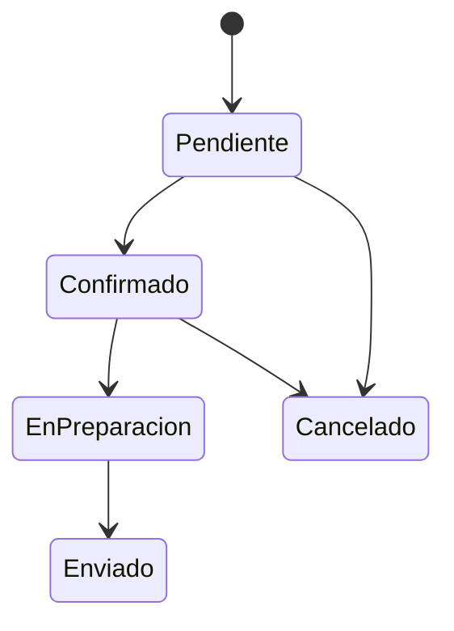

# Tema 9. Herramientas y automatización para SDD

## Descripción

En este tema se presenta una panorámica de herramientas, repositorios, formatos
y flujos de trabajo que permiten integrar las especificaciones en el trabajo
diario del equipo.

El desarrollo dirigido por especificaciones, o SDD, necesita algo más que buenos
documentos. Requiere que las especificaciones estén disponibles, versionadas,
revisadas, conectadas con pruebas y publicadas de forma accesible para las
personas que las usan.

Una especificación viva debe poder consultarse, cambiarse, validarse y
publicarse de forma controlada. Para lograrlo se combinan prácticas de
documentación, control de versiones, automatización, revisión colaborativa y
validación continua.

## Objetivos

Al finalizar este tema, el participante será capaz de:

* Conocer herramientas útiles para documentar y mantener especificaciones.
* Integrar especificaciones en el flujo de trabajo habitual del equipo.
* Automatizar validaciones, revisiones y publicación de artefactos.
* Favorecer especificaciones vivas, accesibles y actualizadas.
* Diseñar una estructura de repositorio para especificaciones versionadas.
* Definir un flujo de revisión colaborativa para cambios funcionales.
* Publicar documentación viva desde un proceso automatizado.

## 1. El papel de las herramientas en SDD

Las herramientas no sustituyen la conversación entre negocio, QA y desarrollo.
Su función es sostener esa conversación y convertir sus resultados en artefactos
útiles, trazables y mantenibles.

Una herramienta adecuada debe ayudar a responder preguntas como:

* ¿Dónde está la especificación vigente?
* ¿Quién la modificó?
* ¿Qué cambió respecto a la versión anterior?
* ¿Qué criterios de aceptación están aprobados?
* ¿Qué pruebas validan esta regla?
* ¿Qué documentación se ha publicado?
* ¿Qué partes están pendientes de revisión?

Sin herramientas y automatización, las especificaciones tienden a quedar
dispersas en documentos, correos, tareas, conversaciones o páginas
desactualizadas.

## 2. Principios para seleccionar herramientas

Antes de elegir herramientas concretas, conviene definir principios de trabajo.

Una buena herramienta para SDD debería cumplir estas condiciones:

* Facilitar la colaboración entre perfiles funcionales y técnicos.
* Permitir historial de cambios.
* Soportar revisión antes de aprobar modificaciones.
* Integrarse con el flujo de desarrollo.
* Permitir automatización.
* Ser accesible para las personas que necesitan consultar la información.
* Evitar duplicar información innecesariamente.
* Permitir enlazar especificaciones, tareas, código y pruebas.
* Favorecer documentación viva.

La herramienta más sofisticada no siempre es la más adecuada. Una solución
simple, bien integrada y usada por todo el equipo suele generar más valor que
una plataforma compleja que nadie mantiene.

## 3. Tipos de herramientas útiles

En SDD se pueden combinar distintas categorías de herramientas.

| Categoría                      | Uso principal                               |
| ------------------------------ | ------------------------------------------- |
| Repositorios                   | Versionar especificaciones y pruebas        |
| Wikis                          | Publicar documentación accesible            |
| Gestores de tareas             | Relacionar cambios con trabajo planificado  |
| Herramientas BDD               | Ejecutar escenarios de comportamiento       |
| Validadores                    | Revisar formato, estilo y consistencia      |
| CI/CD                          | Automatizar validaciones y publicación      |
| Generadores de documentación   | Crear sitios navegables                     |
| Herramientas de diagramado     | Representar flujos y modelos                |
| Sistemas de diseño             | Documentar componentes y reglas de interfaz |
| Herramientas de observabilidad | Contrastar comportamiento real con esperado |

Lo importante es diseñar un flujo coherente entre ellas.

## 4. Repositorios para especificaciones

Guardar especificaciones en un repositorio versionado permite aplicar prácticas
similares a las usadas con el código.

Ventajas:

* Historial de cambios.
* Comparación entre versiones.
* Ramas de trabajo.
* Revisiones mediante pull request o merge request.
* Integración con automatización.
* Trazabilidad con código y pruebas.
* Posibilidad de publicar documentación automáticamente.

Ejemplo de repositorio:

```text
sdd-producto/
  README.md
  docs/
  specs/
  features/
  decisions/
  tests/
  scripts/
  .github/
```

Esta estructura permite separar documentación general, especificaciones,
escenarios ejecutables, decisiones y automatización.

## 5. Formatos de especificación

El formato elegido influye en la facilidad de mantenimiento y automatización.

### 5.1 Markdown

Markdown es útil para documentación funcional, criterios de aceptación,
decisiones y guías.

Ventajas:

* Fácil de leer.
* Fácil de versionar.
* Compatible con muchas plataformas.
* Adecuado para revisión colaborativa.
* Puede publicarse como sitio web.

Ejemplo:

```markdown
# Consulta de pedidos recientes

## Regla

Se consideran recientes los pedidos realizados en los últimos 180 días.

## Criterios de aceptación

- El cliente autenticado puede consultar sus pedidos recientes.
- Los pedidos se muestran de más reciente a más antiguo.
- Un pedido realizado hace 180 días debe incluirse.
- Un pedido realizado hace 181 días no debe incluirse.
```

### 5.2 Gherkin

Gherkin permite expresar escenarios de comportamiento en formato estructurado.

Ejemplo:

```gherkin
Feature: Consulta de pedidos recientes

  Rule: Los pedidos recientes son los realizados en los últimos 180 días

    Scenario: Incluir pedido realizado exactamente hace 180 días
      Given existe un cliente autenticado
      And tiene un pedido realizado hace 180 días
      When consulta sus pedidos recientes
      Then el sistema muestra el pedido
```

Puede ser interpretado por herramientas BDD cuando existen definiciones técnicas
de pasos.

### 5.3 OpenAPI

OpenAPI permite describir contratos de API REST.

Uso habitual:

* Definir endpoints.
* Documentar entradas y salidas.
* Validar contratos.
* Generar documentación técnica.
* Generar clientes o servidores base.
* Ejecutar pruebas contractuales.

Ejemplo simplificado:

```yaml
openapi: 3.0.3
info:
  title: API de pedidos
  version: 1.0.0
paths:
  /orders/recent:
    get:
      summary: Consulta pedidos recientes
      responses:
        "200":
          description: Lista de pedidos recientes
```

### 5.4 JSON Schema

JSON Schema permite definir la estructura esperada de documentos JSON.

Uso habitual:

* Validar mensajes.
* Definir eventos.
* Validar payloads.
* Controlar compatibilidad entre versiones.

Ejemplo:

```json
{
  "type": "object",
  "required": ["id", "status", "total"],
  "properties": {
    "id": {
      "type": "string"
    },
    "status": {
      "type": "string",
      "enum": ["pending", "confirmed", "cancelled"]
    },
    "total": {
      "type": "number",
      "minimum": 0
    }
  }
}
```

### 5.5 Diagramas como código

Los diagramas como código permiten representar flujos, estados o arquitectura de
forma versionable.

Ejemplo con Mermaid:



El diagrama queda dentro del repositorio y puede evolucionar con la
especificación.

## 6. Especificaciones vivas

Una especificación viva es una especificación que permanece actualizada porque
forma parte del flujo de trabajo del equipo.

Características:

* Está versionada.
* Tiene propietario o responsables claros.
* Se revisa antes de aprobar cambios.
* Está conectada con pruebas o validaciones.
* Se publica de forma accesible.
* Se actualiza cuando cambia el producto.
* Se elimina o marca como obsoleta cuando deja de ser válida.

Una especificación viva no es simplemente un documento bonito. Es un artefacto
que el equipo usa para decidir, construir, probar y comunicar.

## 7. Repositorio como fuente de verdad

Una práctica recomendable es definir el repositorio como fuente principal de
verdad para especificaciones aprobadas.

Esto evita que existan varias versiones contradictorias en herramientas
distintas.

Ejemplo de distribución de responsabilidades:

| Herramienta      | Uso                                 |
| ---------------- | ----------------------------------- |
| Repositorio      | Fuente de verdad versionada         |
| Wiki o portal    | Publicación para consulta           |
| Gestor de tareas | Planificación y seguimiento         |
| Chat             | Conversación y coordinación         |
| CI/CD            | Validación y publicación automática |

La conversación puede ocurrir en reuniones o chats, pero la decisión final debe
quedar registrada en el artefacto versionado.

## 8. Estructura recomendada de repositorio

Una posible estructura para SDD es la siguiente:

```text
sdd-producto/
  README.md
  specs/
    pedidos/
      consulta-pedidos.md
      cancelacion-pedidos.md
      estados-pedido.md
    usuarios/
      cambio-contrasena.md
      recuperacion-contrasena.md
  features/
    pedidos/
      consulta-pedidos.feature
      cancelacion-pedidos.feature
    usuarios/
      recuperacion-contrasena.feature
  contracts/
    openapi/
      pedidos.yaml
    schemas/
      pedido-creado.schema.json
  decisions/
    adr-001-estructura-repositorio.md
    df-001-regla-cancelacion.md
  docs/
    index.md
    glosario.md
  scripts/
    validate-markdown.sh
    validate-openapi.sh
  .github/
    workflows/
      validate-docs.yml
      publish-docs.yml
```

Esta estructura separa cada tipo de artefacto y facilita la automatización.

## 9. Archivo README del repositorio

El archivo `README.md` debe explicar cómo usar el repositorio.

Contenido recomendado:

* Propósito del repositorio.
* Estructura de carpetas.
* Formatos aceptados.
* Cómo proponer cambios.
* Cómo ejecutar validaciones.
* Cómo publicar documentación.
* Convenciones de nombres.
* Responsables o canales de soporte.

Ejemplo:

```markdown
# Especificaciones del producto

Este repositorio contiene especificaciones funcionales, escenarios de aceptación,
contratos y documentación viva del producto.

## Estructura

- `specs/`: especificaciones funcionales.
- `features/`: escenarios BDD.
- `contracts/`: contratos de API y esquemas.
- `decisions/`: decisiones funcionales y técnicas.
- `docs/`: documentación publicada.
- `scripts/`: scripts de validación.

## Flujo de trabajo

Todo cambio debe realizarse mediante una rama y revisarse antes de fusionarse en
`main`.
```

## 10. Convenciones de nombres

Las convenciones de nombres ayudan a localizar archivos y evitar duplicados.

Ejemplos:

```text
consulta-pedidos.md
cancelacion-pedidos.feature
recuperacion-contrasena.md
pedido-creado.schema.json
df-014-cancelacion-pedidos.md
adr-003-publicacion-documentacion.md
```

Buenas prácticas:

* Usar nombres descriptivos.
* Evitar espacios.
* Usar minúsculas.
* Separar palabras con guiones.
* Incluir prefijos cuando sean útiles.
* Mantener consistencia por dominio.

## 11. Automatización de validaciones

La automatización permite detectar problemas antes de aprobar cambios.

Validaciones habituales:

* Formato Markdown.
* Enlaces rotos.
* Estructura de documentos.
* Sintaxis Gherkin.
* Validez de OpenAPI.
* Validez de JSON Schema.
* Existencia de metadatos obligatorios.
* Coherencia de versiones.
* Ejecución de pruebas BDD.
* Generación correcta de documentación.

Ejemplo de validaciones mínimas:

```text
markdownlint docs/**/*.md specs/**/*.md
gherkin-lint features/**/*.feature
spectral lint contracts/openapi/*.yaml
```

Estas validaciones pueden ejecutarse localmente y en integración continua.

## 12. Integración continua para especificaciones

La integración continua no solo sirve para código. También puede validar
artefactos de especificación.

Ejemplo de flujo:

```text
Cambio en rama
  -> Validar Markdown
  -> Validar Gherkin
  -> Validar contratos
  -> Generar documentación
  -> Ejecutar pruebas de aceptación
  -> Permitir revisión
```

Si una validación falla, el cambio no debería aprobarse hasta corregirse.

## 13. Ejemplo de flujo CI

Ejemplo simplificado con GitHub Actions:

```yaml
name: Validar especificaciones

on:
  pull_request:
    paths:
      - "specs/**"
      - "features/**"
      - "contracts/**"
      - "docs/**"

jobs:
  validate:
    runs-on: ubuntu-latest

    steps:
      - name: Descargar repositorio
        uses: actions/checkout@v4

      - name: Validar Markdown
        run: npx markdownlint-cli2 "**/*.md"

      - name: Validar especificaciones Gherkin
        run: npx gherkin-lint "features/**/*.feature"

      - name: Validar contratos OpenAPI
        run: npx @stoplight/spectral-cli lint "contracts/openapi/*.yaml"
```

Este flujo revisa la calidad básica de los artefactos antes de fusionarlos.

## 14. Revisión colaborativa

La revisión colaborativa permite que negocio, QA y desarrollo validen el cambio
antes de hacerlo vigente.

Una revisión de especificación debería incluir:

* Revisión funcional.
* Revisión de pruebas.
* Revisión técnica.
* Revisión de lenguaje.
* Revisión de impacto.
* Revisión de consistencia con reglas existentes.

Cada perfil aporta una perspectiva distinta.

| Perfil      | Foco de revisión                    |
| ----------- | ----------------------------------- |
| Negocio     | Valor, reglas, excepciones          |
| QA          | Casos límite, verificabilidad       |
| Desarrollo  | Viabilidad, impacto técnico         |
| UX          | Claridad de flujos e interfaz       |
| Seguridad   | Riesgos, privacidad, abuso          |
| Operaciones | Soporte, despliegue, monitorización |

## 15. Pull requests de especificación

Un pull request de especificación debe explicar el cambio de forma clara.

Contenido recomendado:

* Resumen del cambio.
* Motivo.
* Especificaciones afectadas.
* Criterios actualizados.
* Escenarios actualizados.
* Impacto funcional.
* Impacto técnico.
* Pruebas o validaciones ejecutadas.
* Decisiones pendientes.

Ejemplo de descripción:

```markdown
# Cambio propuesto

Se amplía el periodo de pedidos recientes de 90 a 180 días.

## Motivo

Reducir consultas manuales al equipo de soporte.

## Artefactos modificados

- `specs/pedidos/consulta-pedidos.md`
- `features/pedidos/consulta-pedidos.feature`

## Impacto

- Cambian criterios de aceptación.
- Se añaden escenarios de borde.
- Puede aumentar el volumen de resultados.

## Validaciones

- Markdown validado.
- Escenarios Gherkin validados.
```

## 16. Plantillas para cambios

Las plantillas ayudan a que todas las propuestas incluyan información mínima.

Ejemplo de plantilla de pull request:

```markdown
# Resumen

[Describir el cambio.]

## Motivo

[Explicar por qué se realiza.]

## Tipo de cambio

- [ ] Cambio funcional
- [ ] Cambio técnico
- [ ] Corrección editorial
- [ ] Nueva especificación
- [ ] Deprecación

## Artefactos afectados

- [ ] Especificaciones
- [ ] Escenarios BDD
- [ ] Contratos
- [ ] Documentación publicada
- [ ] Pruebas automatizadas

## Análisis de impacto

[Describir impacto funcional, técnico y de pruebas.]

## Validaciones realizadas

- [ ] Markdown
- [ ] Gherkin
- [ ] Contratos
- [ ] Enlaces
- [ ] Pruebas asociadas

## Revisores necesarios

- [ ] Producto
- [ ] QA
- [ ] Desarrollo
- [ ] Seguridad
- [ ] Operaciones
```

## 17. Automatización de publicación

La publicación automatizada convierte especificaciones versionadas en
documentación accesible.

Posibles destinos:

* Sitio estático interno.
* Wiki corporativa.
* Portal de documentación.
* Artefacto descargable.
* Documentación de API.
* Reporte de pruebas de aceptación.

Ejemplo de flujo:

```text
Fusionar en main
  -> Validar artefactos
  -> Generar sitio
  -> Publicar documentación
  -> Notificar al equipo
```

La publicación automática reduce el riesgo de que la documentación publicada no
coincida con la versión aprobada.

## 18. Generadores de documentación

Existen múltiples enfoques para generar documentación viva.

Opciones habituales:

* Sitios estáticos desde Markdown.
* Documentación de API desde OpenAPI.
* Reportes de escenarios BDD.
* Diagramas generados desde código.
* Portales internos integrados con repositorios.

Características deseables:

* Navegación sencilla.
* Buscador.
* Índice por dominio.
* Fecha de actualización.
* Versión visible.
* Estado de la especificación.
* Enlaces a criterios y pruebas.
* Enlaces a decisiones relacionadas.

## 19. Publicación de reportes BDD

Cuando se usan escenarios ejecutables, los resultados pueden publicarse como
evidencia de validación.

Un reporte BDD puede mostrar:

* Funcionalidades validadas.
* Escenarios ejecutados.
* Escenarios correctos.
* Escenarios fallidos.
* Escenarios pendientes.
* Fecha de ejecución.
* Entorno.
* Versión del producto.
* Versión de especificación.

Esto convierte las pruebas en documentación útil para negocio y QA.

## 20. Control de calidad de documentación

La documentación también necesita control de calidad.

Validaciones recomendadas:

* Títulos jerárquicos correctos.
* Enlaces válidos.
* Tablas bien formadas.
* Bloques de código etiquetados.
* Ausencia de términos prohibidos o ambiguos.
* Glosario consistente.
* Fechas y versiones actualizadas.
* Referencias a documentos existentes.
* Ortografía y estilo.

Ejemplo de comprobaciones:

```text
markdownlint
lychee
vale
cspell
```

Cada equipo puede adaptar el nivel de exigencia según su madurez.

## 21. Trazabilidad automatizada

La trazabilidad puede automatizarse parcialmente mediante convenciones.

Ejemplo de metadatos en una especificación:

```yaml
id: SPEC-PED-001
title: Consulta de pedidos recientes
version: 1.3.0
status: approved
owner: producto-pedidos
related_features:
  - features/pedidos/consulta-pedidos.feature
related_decisions:
  - decisions/df-017-periodo-pedidos-recientes.md
related_tickets:
  - US-245
```

Estos metadatos pueden usarse para generar índices, validar referencias o crear
matrices de trazabilidad.

## 22. Ejemplo de cabecera en Markdown

Una especificación puede incluir una cabecera estructurada.

```markdown
---
id: SPEC-PED-001
title: Consulta de pedidos recientes
version: 1.3.0
status: approved
owner: producto-pedidos
---

# Consulta de pedidos recientes

## Regla principal

Se consideran recientes los pedidos realizados en los últimos 180 días.
```

La cabecera puede ser procesada por herramientas de publicación o validación.

## 23. Reglas automatizables

No todo se puede automatizar, pero muchas comprobaciones sí.

Ejemplos de reglas automatizables:

* Toda especificación debe tener identificador.
* Toda especificación debe tener versión.
* Toda especificación aprobada debe tener propietario.
* Todo escenario BDD debe estar asociado a una especificación.
* No puede haber enlaces rotos.
* No puede publicarse documentación si falla el lint.
* No puede aprobarse un contrato OpenAPI inválido.
* No puede fusionarse un cambio sin revisión de QA.
* No puede existir una especificación aprobada sin criterios de aceptación.

Ejemplo de regla expresada en lenguaje natural:

```text
Si un archivo en specs/ tiene status: approved, debe incluir una sección
llamada "Criterios de aceptación".
```

Esta regla podría implementarse mediante un script de validación.

## 24. Scripts de validación

Los scripts permiten adaptar validaciones a las necesidades del equipo.

Ejemplo conceptual:

```bash
#!/usr/bin/env bash
set -euo pipefail

echo "Validando Markdown"
npx markdownlint-cli2 "specs/**/*.md" "docs/**/*.md"

echo "Validando escenarios Gherkin"
npx gherkin-lint "features/**/*.feature"

echo "Validando contratos OpenAPI"
npx @stoplight/spectral-cli lint "contracts/openapi/*.yaml"

echo "Validación completada"
```

Este script puede ejecutarse localmente o en CI.

## 25. Automatización y definición de terminado

La definición de terminado puede incluir comprobaciones sobre especificaciones.

Ejemplo:

* La especificación está actualizada.
* Los criterios de aceptación están revisados.
* Los escenarios BDD afectados están actualizados.
* Los contratos modificados están validados.
* La documentación viva se ha publicado.
* Las pruebas de aceptación pasan.
* Las decisiones relevantes están registradas.
* Los equipos afectados han sido informados.

Así se evita que la documentación quede como una tarea posterior.

## 26. Integración con gestores de tareas

Las especificaciones deben conectarse con historias, incidencias o solicitudes
de cambio.

Ejemplo de relación:

| Artefacto      | Referencia               |
| -------------- | ------------------------ |
| Historia       | US-245                   |
| Especificación | SPEC-PED-001             |
| Escenario      | consulta-pedidos.feature |
| Pull request   | PR-812                   |
| Decisión       | DF-017                   |
| Release        | 2026.03                  |

Esta relación facilita auditoría, seguimiento y comunicación.

## 27. Integración con diseño y UX

Las especificaciones funcionales pueden conectarse con artefactos de diseño.

Relaciones útiles:

* Pantallas.
* Flujos de navegación.
* Estados vacíos.
* Mensajes de error.
* Componentes reutilizables.
* Reglas de accesibilidad.
* Prototipos.
* Microcopys.

Ejemplo:

| Regla funcional          | Impacto UX                           |
| ------------------------ | ------------------------------------ |
| No hay pedidos recientes | Estado vacío con mensaje informativo |
| Pedido no cancelable     | Botón deshabilitado con explicación  |
| Cupón caducado           | Mensaje de error específico          |
| Correo no registrado     | Mensaje genérico de seguridad        |

La especificación debe describir el comportamiento. El diseño concreta la
experiencia de uso.

## 28. Integración con contratos de API

Cuando una funcionalidad depende de una API, la especificación funcional debe
estar alineada con el contrato técnico.

Ejemplo:

Criterio funcional:

> El cliente puede consultar sus pedidos recientes.

Contrato técnico relacionado:

```yaml
paths:
  /orders/recent:
    get:
      summary: Obtener pedidos recientes del cliente autenticado
      responses:
        "200":
          description: Lista de pedidos recientes
        "401":
          description: Usuario no autenticado
```

Si cambia la regla funcional, puede cambiar también el contrato o sus
restricciones.

## 29. Integración con pruebas automatizadas

Las especificaciones pueden conectarse con distintos tipos de pruebas.

| Tipo de prueba | Relación con especificación            |
| -------------- | -------------------------------------- |
| Unitarias      | Validan reglas aisladas                |
| Integración    | Validan colaboración entre componentes |
| Contrato       | Validan APIs y mensajes                |
| Aceptación     | Validan criterios funcionales          |
| End-to-end     | Validan flujos completos               |

La automatización debe priorizar los casos de mayor valor y riesgo.

## 30. Datos de prueba como artefacto

Los datos de prueba también pueden versionarse.

Ejemplo de estructura:

```text
test-data/
  pedidos/
    pedidos-recientes.json
    pedidos-cancelacion.json
  usuarios/
    usuarios-recuperacion.json
```

Ventajas:

* Datos reproducibles.
* Escenarios más claros.
* Menos dependencia de entornos manuales.
* Mejor trazabilidad.
* Validación consistente.

Ejemplo de dato de prueba:

```json
{
  "customerId": "CUST-001",
  "orders": [
    {
      "id": "ORD-001",
      "createdDaysAgo": 30,
      "status": "confirmed"
    },
    {
      "id": "ORD-002",
      "createdDaysAgo": 181,
      "status": "delivered"
    }
  ]
}
```

## 31. Publicación de documentación viva

Una publicación útil debe estar pensada para sus lectores.

Audiencias habituales:

* Producto.
* Negocio.
* QA.
* Desarrollo.
* Soporte.
* Operaciones.
* Seguridad.
* Nuevas incorporaciones.

Contenido recomendado:

* Índice por dominio.
* Buscador.
* Especificaciones vigentes.
* Historial de cambios.
* Criterios de aceptación.
* Escenarios de comportamiento.
* Contratos de API.
* Decisiones relevantes.
* Glosario.
* Estado de validación.

## 32. Ejemplo de sitio de documentación

Estructura posible:

```text
site/
  index.html
  pedidos/
    consulta-pedidos.html
    cancelacion-pedidos.html
  usuarios/
    recuperacion-contrasena.html
  api/
    pedidos.html
  decisiones/
    df-014-cancelacion.html
  reportes/
    aceptacion.html
```

La documentación publicada debe generarse desde los artefactos versionados, no
copiarse manualmente.

## 33. Notificaciones automáticas

Cuando cambia una especificación, puede ser útil notificar al equipo.

Ejemplos de notificación:

* Mensaje en canal de producto.
* Comentario en tarea.
* Publicación de release notes.
* Correo a soporte.
* Aviso a QA sobre escenarios modificados.

Contenido mínimo de la notificación:

* Qué cambió.
* Qué versión queda vigente.
* A quién afecta.
* Qué acciones son necesarias.
* Dónde consultar la especificación.

## 34. Gestión de permisos

No todas las personas necesitan los mismos permisos.

Ejemplo:

| Rol         | Permiso recomendado                            |
| ----------- | ---------------------------------------------- |
| Producto    | Proponer y aprobar cambios funcionales         |
| QA          | Proponer escenarios y validar criterios        |
| Desarrollo  | Proponer cambios técnicos y revisar viabilidad |
| Seguridad   | Revisar cambios sensibles                      |
| Soporte     | Consultar documentación publicada              |
| Operaciones | Consultar y revisar impacto operativo          |

Un control de permisos adecuado protege la fuente de verdad sin impedir la
colaboración.

## 35. Métricas útiles

Las métricas ayudan a evaluar la salud de las especificaciones.

Ejemplos:

* Porcentaje de especificaciones con versión.
* Porcentaje de especificaciones con propietario.
* Número de enlaces rotos.
* Número de escenarios automatizados.
* Número de escenarios fallidos.
* Tiempo medio de revisión.
* Especificaciones modificadas por release.
* Especificaciones obsoletas.
* Cobertura de criterios por pruebas.
* Frecuencia de publicación de documentación.

Las métricas deben usarse para mejorar el proceso, no para generar burocracia.

## 36. Antipatrones frecuentes

### 36.1 Documentación fuera del flujo

Problema:

> La especificación está en una herramienta separada y nadie la actualiza durante
> el desarrollo.

Consecuencia:

La documentación pierde credibilidad.

### 36.2 Automatización sin propósito

Problema:

> Se añaden muchas validaciones, pero no se sabe qué problema resuelven.

Consecuencia:

El equipo percibe la automatización como ruido.

### 36.3 Herramientas duplicadas

Problema:

> La misma regla está en una wiki, en un documento, en una tarea y en un archivo
> de pruebas.

Consecuencia:

Aparecen contradicciones.

### 36.4 Publicación manual

Problema:

> La documentación se actualiza manualmente después de cada entrega.

Consecuencia:

La versión publicada puede no coincidir con la versión aprobada.

### 36.5 Escenarios automatizados ilegibles

Problema:

> Los escenarios BDD están escritos con lenguaje técnico y solo desarrollo los
> entiende.

Consecuencia:

Pierden valor como herramienta de colaboración.

## 37. Laboratorio 1: Configuración de repositorio

### 37.1 Enunciado

Configurar una estructura de repositorio para mantener especificaciones
versionadas de un producto de comercio electrónico.

El repositorio debe permitir:

* Guardar especificaciones funcionales.
* Guardar escenarios BDD.
* Guardar contratos de API.
* Registrar decisiones.
* Validar documentación.
* Publicar documentación viva.

### 37.2 Solución propuesta

Estructura del repositorio:

```text
ecommerce-sdd/
  README.md
  specs/
    pedidos/
      consulta-pedidos.md
      cancelacion-pedidos.md
      seguimiento-pedidos.md
    carrito/
      aplicacion-cupones.md
      calculo-envio.md
    usuarios/
      registro-usuario.md
      recuperacion-contrasena.md
  features/
    pedidos/
      consulta-pedidos.feature
      cancelacion-pedidos.feature
    carrito/
      aplicacion-cupones.feature
      calculo-envio.feature
    usuarios/
      recuperacion-contrasena.feature
  contracts/
    openapi/
      pedidos.yaml
      carrito.yaml
      usuarios.yaml
    schemas/
      pedido-creado.schema.json
      cupon-aplicado.schema.json
  decisions/
    adr-001-estructura-repositorio.md
    df-001-regla-envio-gratuito.md
    df-002-cancelacion-pedidos.md
  docs/
    index.md
    glosario.md
    guia-contribucion.md
  test-data/
    pedidos/
      pedidos-recientes.json
    carrito/
      cupones.json
  scripts/
    validate.sh
    build-docs.sh
  .github/
    workflows/
      validate.yml
      publish-docs.yml
```

### 37.3 Archivo README

````markdown
# Especificaciones SDD de comercio electrónico

Este repositorio contiene especificaciones funcionales, escenarios de aceptación,
contratos de API, datos de prueba y documentación viva del producto.

## Estructura

- `specs/`: especificaciones funcionales por dominio.
- `features/`: escenarios BDD verificables.
- `contracts/`: contratos de API y esquemas de mensajes.
- `decisions/`: decisiones funcionales y técnicas.
- `docs/`: documentación publicada y guías.
- `test-data/`: datos de prueba versionados.
- `scripts/`: scripts de validación y publicación.

## Flujo de trabajo

Todo cambio debe realizarse mediante una rama específica y revisarse antes de
fusionarse en `main`.

## Validación local

```bash
./scripts/validate.sh
```

## Publicación

La documentación viva se publica automáticamente al fusionar cambios en `main`.
````

### 37.4 Script de validación

```bash
#!/usr/bin/env bash
set -euo pipefail

echo "Validando Markdown"
npx markdownlint-cli2 "README.md" "docs/**/*.md" "specs/**/*.md"

echo "Validando Gherkin"
npx gherkin-lint "features/**/*.feature"

echo "Validando OpenAPI"
npx @stoplight/spectral-cli lint "contracts/openapi/*.yaml"

echo "Validaciones completadas correctamente"
```

### 37.5 Flujo de validación en CI

```yaml
name: Validar especificaciones

on:
  pull_request:
    paths:
      - "README.md"
      - "docs/**"
      - "specs/**"
      - "features/**"
      - "contracts/**"
      - "scripts/**"

jobs:
  validate:
    runs-on: ubuntu-latest

    steps:
      - name: Descargar repositorio
        uses: actions/checkout@v4

      - name: Preparar Node
        uses: actions/setup-node@v4
        with:
          node-version: "20"

      - name: Instalar herramientas
        run: |
          npm install --global markdownlint-cli2
          npm install --global gherkin-lint
          npm install --global @stoplight/spectral-cli

      - name: Ejecutar validaciones
        run: ./scripts/validate.sh
```

### 37.6 Convenciones definidas

| Elemento               | Convención                                      |
| ---------------------- | ----------------------------------------------- |
| Especificaciones       | `specs/dominio/nombre-funcionalidad.md`         |
| Escenarios BDD         | `features/dominio/nombre-funcionalidad.feature` |
| Contratos API          | `contracts/openapi/dominio.yaml`                |
| Esquemas               | `contracts/schemas/nombre-evento.schema.json`   |
| Decisiones funcionales | `decisions/df-numero-descripcion.md`            |
| Decisiones técnicas    | `decisions/adr-numero-descripcion.md`           |

### 37.7 Resultado

La configuración propuesta permite mantener las especificaciones como artefactos
versionados, validables y publicables. Además, separa claramente documentación,
escenarios, contratos, decisiones y datos de prueba.

## 38. Laboratorio 2: Flujo de revisión colaborativa

### 38.1 Enunciado

Diseñar un flujo de revisión colaborativa para modificar la especificación de
gastos de envío.

Situación actual:

> Los pedidos de 50 euros o más tienen envío gratuito.

Cambio propuesto:

> Los pedidos de 40 euros o más tendrán envío gratuito solo para clientes
> registrados. Los clientes invitados mantienen el umbral de 50 euros.

El flujo debe incluir roles, pasos, validaciones y criterios de aprobación.

### 38.2 Análisis inicial

El cambio afecta a una regla de negocio existente. No es un simple ajuste
editorial, porque introduce una diferencia entre clientes registrados e
invitados.

Impactos principales:

| Área                    | Impacto         |
| ----------------------- | --------------- |
| Reglas de negocio       | Alto            |
| Criterios de aceptación | Alto            |
| Escenarios BDD          | Alto            |
| Interfaz                | Medio           |
| API de carrito          | Posible impacto |
| Pruebas                 | Alto            |
| Soporte                 | Medio           |
| Analítica               | Medio           |

### 38.3 Roles implicados

| Rol           | Responsabilidad                  |
| ------------- | -------------------------------- |
| Product Owner | Validar objetivo de negocio      |
| QA            | Revisar casos límite             |
| Desarrollo    | Evaluar impacto técnico          |
| UX            | Revisar mensajes y visualización |
| Soporte       | Preparar comunicación            |
| Analítica     | Revisar métricas de conversión   |

### 38.4 Flujo propuesto

```text
Solicitud de cambio
  -> Rama de especificación
  -> Actualización de criterios
  -> Actualización de escenarios BDD
  -> Análisis de impacto
  -> Revisión por Producto, QA y Desarrollo
  -> Validaciones automáticas
  -> Aprobación
  -> Fusión en main
  -> Publicación de documentación viva
```

### 38.5 Rama de trabajo

```text
change/envio-gratuito-clientes-registrados
```

### 38.6 Cambios en la especificación

Nueva regla:

```markdown
## Regla de envío gratuito

Los clientes registrados tienen envío gratuito en pedidos de 40 euros o más.

Los clientes invitados tienen envío gratuito en pedidos de 50 euros o más.
```

Criterios de aceptación:

* Un cliente registrado con cesta de 40 euros tiene envío gratuito.
* Un cliente registrado con cesta de 39,99 euros no tiene envío gratuito.
* Un cliente invitado con cesta de 50 euros tiene envío gratuito.
* Un cliente invitado con cesta de 49,99 euros no tiene envío gratuito.
* El tipo de cliente debe determinarse antes de calcular el envío.
* El sistema debe mostrar el umbral aplicable al cliente.

### 38.7 Escenarios BDD

```gherkin
Feature: Cálculo de envío gratuito

  Rule: El umbral de envío gratuito depende del tipo de cliente

    Scenario: Envío gratuito para cliente registrado desde 40 euros
      Given existe un cliente registrado
      And tiene una cesta con importe de 40 euros
      When el sistema calcula los gastos de envío
      Then el coste de envío es 0 euros
      And muestra el mensaje "Envío gratuito aplicado"

    Scenario: Sin envío gratuito para cliente registrado por debajo de 40 euros
      Given existe un cliente registrado
      And tiene una cesta con importe de 39,99 euros
      When el sistema calcula los gastos de envío
      Then el coste de envío es 4,99 euros

    Scenario: Envío gratuito para cliente invitado desde 50 euros
      Given existe un cliente invitado
      And tiene una cesta con importe de 50 euros
      When el sistema calcula los gastos de envío
      Then el coste de envío es 0 euros
      And muestra el mensaje "Envío gratuito aplicado"

    Scenario: Sin envío gratuito para cliente invitado por debajo de 50 euros
      Given existe un cliente invitado
      And tiene una cesta con importe de 49,99 euros
      When el sistema calcula los gastos de envío
      Then el coste de envío es 4,99 euros
```

### 38.8 Validaciones automáticas

Validaciones requeridas antes de aprobar:

```text
markdownlint specs/**/*.md
gherkin-lint features/**/*.feature
spectral lint contracts/openapi/*.yaml
```

Validaciones funcionales esperadas:

* Los cuatro escenarios BDD nuevos existen.
* Los casos de frontera están cubiertos.
* La especificación indica explícitamente el umbral por tipo de cliente.
* No queda una regla antigua contradictoria.
* La documentación publicada muestra la nueva regla.

### 38.9 Criterios de aprobación

El cambio puede aprobarse si:

* Producto confirma que la regla responde al objetivo de negocio.
* QA confirma que los casos límite están cubiertos.
* Desarrollo confirma que el tipo de cliente está disponible en el cálculo.
* UX confirma que el mensaje mostrado es claro.
* Las validaciones automáticas pasan.
* La documentación viva se genera correctamente.
* Soporte recibe el resumen del cambio.

### 38.10 Plantilla de pull request

```markdown
# Cambio en regla de envío gratuito

## Resumen

Se modifica el umbral de envío gratuito según el tipo de cliente.

## Motivo

Incentivar el registro de clientes.

## Regla nueva

- Clientes registrados: envío gratuito desde 40 euros.
- Clientes invitados: envío gratuito desde 50 euros.

## Artefactos modificados

- `specs/carrito/calculo-envio.md`
- `features/carrito/calculo-envio.feature`

## Impacto

- Cambian criterios de aceptación.
- Se añaden escenarios de frontera.
- Puede requerir mostrar el umbral aplicable en interfaz.

## Validaciones

- [ ] Markdown validado
- [ ] Gherkin validado
- [ ] Revisión de Producto
- [ ] Revisión de QA
- [ ] Revisión de Desarrollo
- [ ] Revisión de UX
```

### 38.11 Resultado

El flujo propuesto permite incorporar el cambio de forma controlada. La nueva
regla se revisa desde varias perspectivas, se valida automáticamente y se publica
como documentación viva tras su aprobación.

## 39. Laboratorio 3: Publicación automatizada

### 39.1 Enunciado

Diseñar una solución para publicar automáticamente la documentación viva de un
repositorio SDD cada vez que se fusionen cambios en la rama `main`.

La solución debe incluir:

* Validación previa.
* Generación de sitio.
* Publicación.
* Evidencia de resultado.
* Notificación al equipo.

### 39.2 Solución propuesta

Se propone un flujo de publicación basado en integración continua.

Flujo general:

```text
Push en main
  -> Descargar repositorio
  -> Instalar herramientas
  -> Validar Markdown
  -> Validar Gherkin
  -> Validar contratos
  -> Generar sitio estático
  -> Publicar sitio
  -> Guardar artefacto
  -> Notificar resultado
```

### 39.3 Estructura de documentación

```text
docs/
  index.md
  glosario.md
  pedidos.md
  carrito.md
  usuarios.md

specs/
  pedidos/
    consulta-pedidos.md
    cancelacion-pedidos.md
  carrito/
    calculo-envio.md
    aplicacion-cupones.md

features/
  pedidos/
    consulta-pedidos.feature
  carrito/
    calculo-envio.feature
```

### 39.4 Script de generación

```bash
#!/usr/bin/env bash
set -euo pipefail

echo "Limpiando salida anterior"
rm -rf site

echo "Creando carpeta de sitio"
mkdir -p site

echo "Copiando documentación base"
cp -R docs/* site/

echo "Copiando especificaciones"
mkdir -p site/specs
cp -R specs/* site/specs/

echo "Copiando escenarios"
mkdir -p site/features
cp -R features/* site/features/

echo "Sitio generado en ./site"
```

En un entorno real, este script podría sustituirse por una herramienta de sitio
estático. El principio importante es que la publicación se genera desde los
artefactos versionados.

### 39.5 Flujo de publicación en CI

```yaml
name: Publicar documentación viva

on:
  push:
    branches:
      - main
    paths:
      - "docs/**"
      - "specs/**"
      - "features/**"
      - "contracts/**"

jobs:
  publish:
    runs-on: ubuntu-latest

    steps:
      - name: Descargar repositorio
        uses: actions/checkout@v4

      - name: Preparar Node
        uses: actions/setup-node@v4
        with:
          node-version: "20"

      - name: Instalar herramientas
        run: |
          npm install --global markdownlint-cli2
          npm install --global gherkin-lint
          npm install --global @stoplight/spectral-cli

      - name: Validar Markdown
        run: npx markdownlint-cli2 "docs/**/*.md" "specs/**/*.md"

      - name: Validar Gherkin
        run: npx gherkin-lint "features/**/*.feature"

      - name: Validar OpenAPI
        run: npx @stoplight/spectral-cli lint "contracts/openapi/*.yaml"

      - name: Generar sitio
        run: ./scripts/build-docs.sh

      - name: Guardar sitio como artefacto
        uses: actions/upload-artifact@v4
        with:
          name: documentacion-viva
          path: site
```

### 39.6 Publicación en portal

La publicación puede hacerse en distintos destinos.

Opciones:

* GitHub Pages.
* GitLab Pages.
* Portal interno.
* Bucket estático.
* Servidor de documentación.
* Wiki corporativa mediante integración.

Ejemplo conceptual:

```text
site/
  -> portal-documentacion-interno
```

La elección depende de las restricciones de la organización.

### 39.7 Evidencias de publicación

El proceso debe dejar evidencias.

Evidencias recomendadas:

| Evidencia              | Descripción                                |
| ---------------------- | ------------------------------------------ |
| Resultado del pipeline | Indica si validación y publicación pasaron |
| Artefacto generado     | Copia del sitio publicado                  |
| Versión del commit     | Identifica el contenido publicado          |
| Fecha de publicación   | Permite auditar vigencia                   |
| Reporte BDD            | Muestra escenarios validados               |
| Enlace al sitio        | Permite consultar documentación viva       |

### 39.8 Notificación al equipo

Ejemplo de mensaje automático:

```markdown
# Documentación viva publicada

La documentación viva se ha publicado correctamente.

## Versión

Commit: `abc1234`

## Contenido actualizado

- Especificaciones funcionales.
- Escenarios BDD.
- Contratos de API.

## Evidencias

- Validación Markdown completada.
- Validación Gherkin completada.
- Validación OpenAPI completada.
- Artefacto de sitio generado.
```

### 39.9 Criterios de aceptación del laboratorio

La solución se considera correcta si:

* La publicación se ejecuta al fusionar cambios en `main`.
* Antes de publicar se ejecutan validaciones.
* Si una validación falla, no se publica.
* El sitio se genera desde los artefactos versionados.
* El resultado queda guardado como artefacto.
* El equipo recibe una notificación o evidencia consultable.
* La documentación publicada representa la versión vigente.

### 39.10 Resultado

La publicación automatizada convierte las especificaciones en documentación viva
real. El equipo no depende de actualizaciones manuales y puede confiar en que la
documentación publicada procede de la versión validada del repositorio.

## 40. Plantilla de madurez de automatización

La siguiente plantilla ayuda a evaluar el nivel de automatización de un equipo.

| Nivel | Características                        | Riesgo principal           |
| ----- | -------------------------------------- | -------------------------- |
| 0     | Documentos manuales dispersos          | Información contradictoria |
| 1     | Repositorio con especificaciones       | Revisión irregular         |
| 2     | Validación automática de formato       | Poca conexión con pruebas  |
| 3     | Escenarios y contratos validados       | Publicación manual         |
| 4     | Publicación automática                 | Métricas limitadas         |
| 5     | Trazabilidad completa y reportes vivos | Coste de mantenimiento     |

El objetivo no siempre es llegar al nivel máximo. El objetivo es alcanzar un
nivel adecuado al riesgo y contexto del producto.

## 41. Checklist para herramientas y automatización

Antes de implantar o mejorar herramientas para SDD, conviene revisar:

* ¿Existe una fuente de verdad para especificaciones?
* ¿Las especificaciones están versionadas?
* ¿Hay convenciones de estructura y nombres?
* ¿Los cambios se revisan antes de aprobarse?
* ¿Hay validaciones automáticas?
* ¿Los escenarios BDD están conectados con criterios?
* ¿Los contratos de API se validan?
* ¿La documentación se publica automáticamente?
* ¿La documentación publicada muestra versión y fecha?
* ¿Los equipos afectados reciben comunicación?
* ¿Se pueden consultar decisiones relevantes?
* ¿Existe trazabilidad entre tarea, especificación, prueba y release?
* ¿Se mide la salud de las especificaciones?

## 42. Buenas prácticas

Para integrar herramientas y automatización en SDD:

* Empezar con un repositorio y convenciones simples.
* Automatizar primero las validaciones que más errores evitan.
* Usar revisiones colaborativas para cambios relevantes.
* Mantener las especificaciones cerca del código y las pruebas.
* Publicar documentación desde la fuente versionada.
* Evitar duplicar reglas en múltiples herramientas.
* Hacer visibles las versiones y estados.
* Añadir metadatos mínimos a las especificaciones.
* Conectar especificaciones con tareas y decisiones.
* Revisar periódicamente especificaciones obsoletas.
* Usar reportes de pruebas como documentación de comportamiento.
* Mantener el proceso ligero y útil.

## 43. Resumen

Las herramientas y la automatización permiten que las especificaciones formen
parte real del flujo de trabajo del equipo. Un repositorio bien estructurado,
formatos adecuados, validaciones automáticas, revisión colaborativa y
publicación continua ayudan a mantener especificaciones vivas.

El objetivo no es documentar más, sino documentar mejor. Una especificación viva
debe estar versionada, revisada, validada y disponible para quienes la necesitan.

La automatización reduce errores, evita documentación desactualizada y mejora la
confianza entre negocio, QA y desarrollo. Cuando las especificaciones se integran
con pruebas, contratos, decisiones y publicación, se convierten en una pieza
central del desarrollo dirigido por especificaciones.
